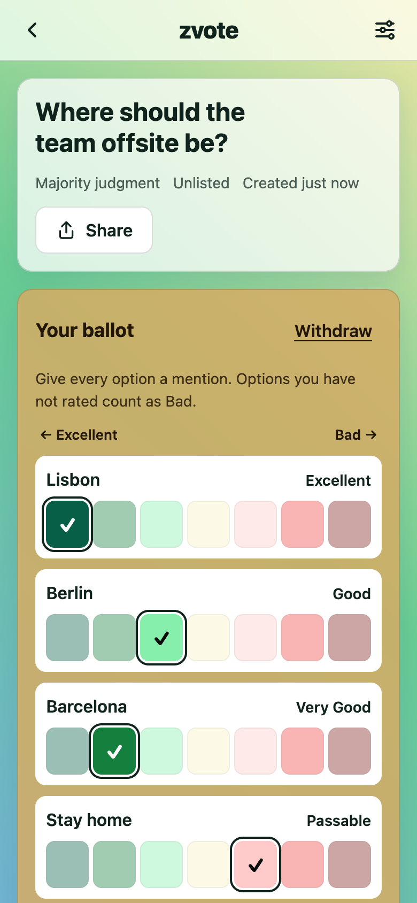
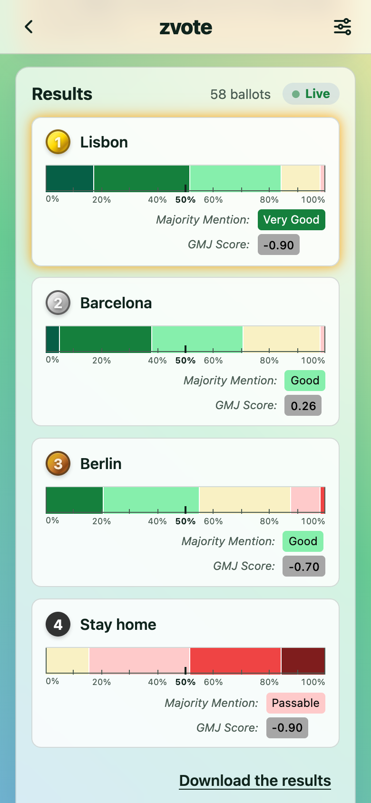
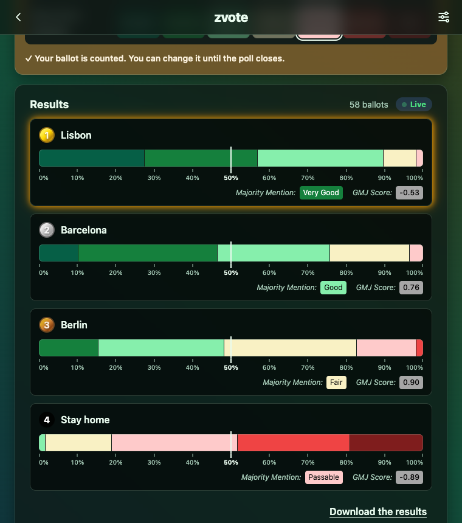

# zvote

zvote is an open-source voting platform for deciding together: pick a
restaurant with friends, choose an offsite with a team, run a live poll in
front of an audience. It implements **majority judgment**, with the graduated
(GMJ) tie-break, and **approval voting**. Results update live as ballots come
in, on a phone or a desktop, with nothing to install and no account needed.

<p>
  
  
</p>

## Features

- **Majority judgment**: voters give every option a mention, from Excellent to
  Bad, and the option with the best majority mention wins. Ties are broken
  with the GMJ score.
- **Approval voting**: voters tick every option they would accept.
- **Live results**, pushed to everyone watching the poll.
- **Revisable ballots**: change or withdraw your ballot until the poll closes.
  Vote *live* (every tap counts) or *in an envelope* (review, then submit).
- **Private polls**, shared by link, join code (`K7M-4QX`), QR code or your
  phone's share sheet. Public polls come back with accounts.
- **For the creator**: close voting (for good), delete the poll, download the
  results.
- **Private by design**: nobody else sees a ballot, only the totals, which
  the creator can keep back until a few ballots are in or the poll closes.
  Stored ballots do not say who cast them.
- **Built to scale**: a poll costs the same to read and to vote on at ten
  million ballots as at ten, on PostgreSQL ([measured](docs/PERFORMANCE.md#ballots-at-scale)).
- **Mobile first**: light and dark themes, and a colour-blind-friendly
  palette.

## Getting started

Two commands, no database to install and no credentials to configure:

```bash
mise install   # provisions the pinned Java 25 and Node 24 (see .tool-versions)
./dev.sh       # starts the server on :8080 and the web app on :5173
```

Then open <http://localhost:5173>. To try it on your phone, open the
"Network" address that Vite prints, from the same Wi-Fi.

Without [mise](https://mise.jdx.dev), any JDK 25+ and Node 20.19+ will do.
Maven is **not** required: `./dev.sh` uses the committed wrapper.

```bash
./dev.sh server   # the server only
./dev.sh client   # the web app only
./dev.sh test     # every check: server tests, client lint, build and tests
```

In development, a poll's creator also sees a *ballot feeder* that casts random
ballots, to watch the results move.

### Your data

The database is embedded (H2 in file mode): everything lives in
`data/zvote.mv.db`, inside the repo folder. Copy the folder and your polls come
with it; the file format is the same on macOS, Linux and Windows, Intel and
ARM. `data/` is not committed. Set `ZVOTE_DATA_DIR` to an absolute path to keep
it elsewhere. The schema is migrated automatically at startup.

## How it is built

| | |
|---|---|
| Server (`servers/java`) | Java 25, Spring Boot 4.1: Spring MVC on virtual threads, Spring Data JDBC, Spring Modulith, Flyway, H2 or PostgreSQL. A REST API, plus server-sent events for live results. |
| Web app (`clients/web`) | React 19, TypeScript, Vite; Vitest and Testing Library; plain CSS. |

- [docs/ARCHITECTURE.md](docs/ARCHITECTURE.md): how it fits together, and why.
- [docs/API.md](docs/API.md): the HTTP API.
- [docs/ROADMAP.md](docs/ROADMAP.md): deployment, accounts and social sign-in,
  installable app, Android, and billions of ballots per poll.
- [docs/PERFORMANCE.md](docs/PERFORMANCE.md): the JVM, Leyden's AOT cache and
  GraalVM native images, and ballots at scale, measured.



## Why majority judgment

Most voting today asks people for a single choice, which throws away almost
everything they think. Majority judgment asks voters to grade every option.
Each option's *majority mention* is the best grade that a majority of voters
agree it deserves at least, and the option with the best one wins. Graduated
majority judgment breaks ties between options with the same majority mention
using how the other grades lean, above or below it.

The result is robust to small changes, hard to game strategically, and
expressive: voters say what they think of every option, not just their
favourite.

Learn more: [Graduated majority judgment](https://en.wikipedia.org/wiki/Graduated_majority_judgment),
[Majority judgment](https://en.wikipedia.org/wiki/Majority_judgment),
[Mieux Voter](https://mieuxvoter.fr/en/le-jugement-majoritaire).

## Vision

Many of the voting systems in use today are outdated. zvote aims to give
everyone better, science-backed tools for deciding together: from everyday
choices (a restaurant, a date) to, in time, community and civic decisions. It
is also built for live, fast decisions, the "Twitch Plays Pokémon" kind, where
many people steer something together in real time.

Design values: open source, science-based methods, live and revisable ballots,
a minimalist interface with tasteful gradients, and an API others can build on.

## Licence and contributing

The code is under the [MIT licence](LICENSE). Design and brand assets may later
live in a separate repository under a different licence.

This is an early-stage project, and contributions are welcome: bug reports,
ideas and patches, especially about correctness, usability and live behaviour.
Before sending code, run `./dev.sh test`.

### References

- [Graduated majority judgment](https://en.wikipedia.org/wiki/Graduated_majority_judgment)
- [Majority judgment](https://en.wikipedia.org/wiki/Majority_judgment)
- [Mieux Voter: le jugement majoritaire](https://mieuxvoter.fr/en/le-jugement-majoritaire)
- [Thesis (Erasmus University)](https://thesis.eur.nl/pub/47746/Thesis.pdf)
- [CREST working paper 2018-15](https://crest.science/RePEc/wpstorage/2018-15.pdf)
- [SCITEPRESS 2022 paper](https://www.scitepress.org/Papers/2022/113194/113194.pdf)
